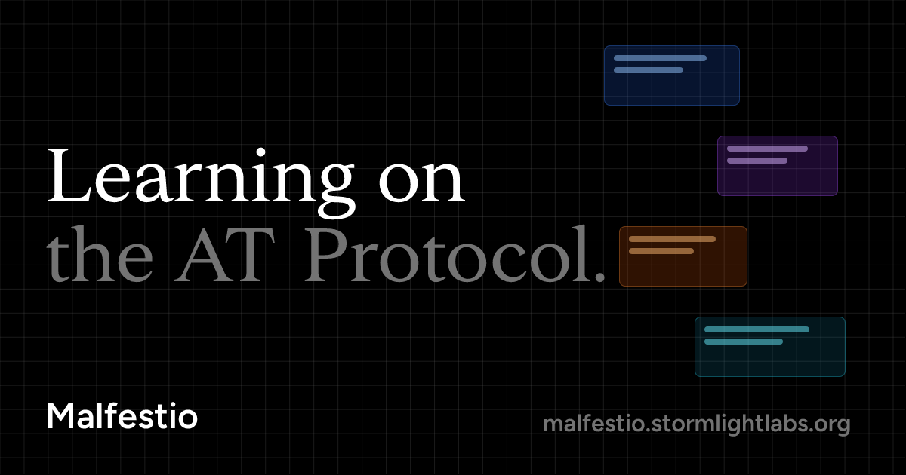

# Malfestio

Malfestio is a social learning platform: flashcards + notes + lectures + articles, designed for daily study
and sharing progress & notes.

## Documentation

- [Local Development](./docs/local-dev.md) - Setup and testing guide
- [Personas & Principles](./docs/personas.md) - Target users and design philosophy
- [Architecture](./docs/architecture.md) - System components and data model
- [Information Architecture](./docs/information-architecture.md) - Navigation and URL structure
- [Data Model Mapping](./docs/data-model-mapping.md) - Lexicon to database mapping
- [Roadmap](./docs/todo.md) - Development milestones

## Test Data

The file `crates/server/tests/data/1904.09828v2.pdf` is included for testing purposes.
It contains the paper "Magic: The Gathering is Turing Complete" (arXiv:1904.09828).
